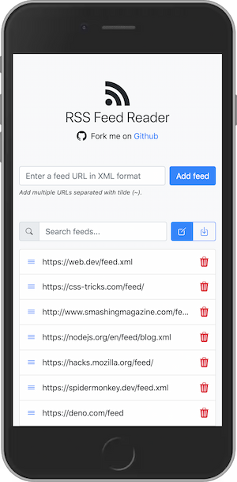
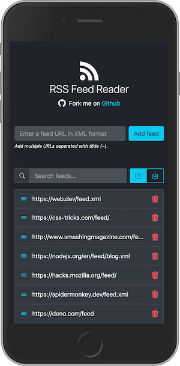

# RSS Feed Reader

A Progressive Web App (PWA) for reading RSS feeds.

## About

RSS Feed Reader is a web application that allows you to read RSS feeds in a clean and simple interface. It is built using Web components and is a Progressive Web App (PWA) which means it can be installed on your device and used offline.

## Live demo

👉 [RSS Feed Reader](https://georapbox.github.io/rss-feed-reader/)

## Features

Some of the key features of the application include:
- Add one or many RSS feeds in XML format.
- Enable/disable feeds per will.
- Export/share feeds URLs to use in other devices (all data is saved on device).

## Screenshots

The following screenshots show the application in action:




## Development

Below are the instructions for setting up the development environment.

### Prerequisites

- **[nvm](https://github.com/nvm-sh/nvm)** (Node Version Manager)

The required Node.js version is managed via **nvm** and defined in the `.nvmrc` file.  
Once the correct Node version is active, the bundled npm version will be used automatically.

### Installation

Clone the repository to your local machine:

```sh
git clone git@github.com:georapbox/rss-feed-reader.git
```

Navigate to the project's directory and install the dependencies:

```sh
npm install
```

### Running the application

To run the application in development mode, run the following command:

```sh
npm start -- --open
```

This will start the development server and open the application in your default web browser.

### Building the application for production

To build the application for production, run the following command:

```sh
npm run build
```

This will create a `dist` directory containing the production build of the application.

### Deployment

To deploy the application, run the following command:

```sh
npm run deploy
```

This will build the application first and then deploy it to GitHub Pages in the `gh-pages` branch.

## Helpful links

- [RSS feeds collection](https://github.com/simevidas/web-dev-feeds) for web developers by [@simevidas](https://github.com/simevidas).
- [Get RSS Feed URL](https://addons.mozilla.org/en-US/firefox/addon/get-rss-feed-url/) Firefox addon
- [Get RSS Feed URL](https://chrome.google.com/webstore/detail/get-rss-feed-url/kfghpdldaipanmkhfpdcjglncmilendn) Chrome extension

## License

[The MIT License (MIT)](https://github.com/georapbox/rss-feed-reader/blob/main/LICENSE)
