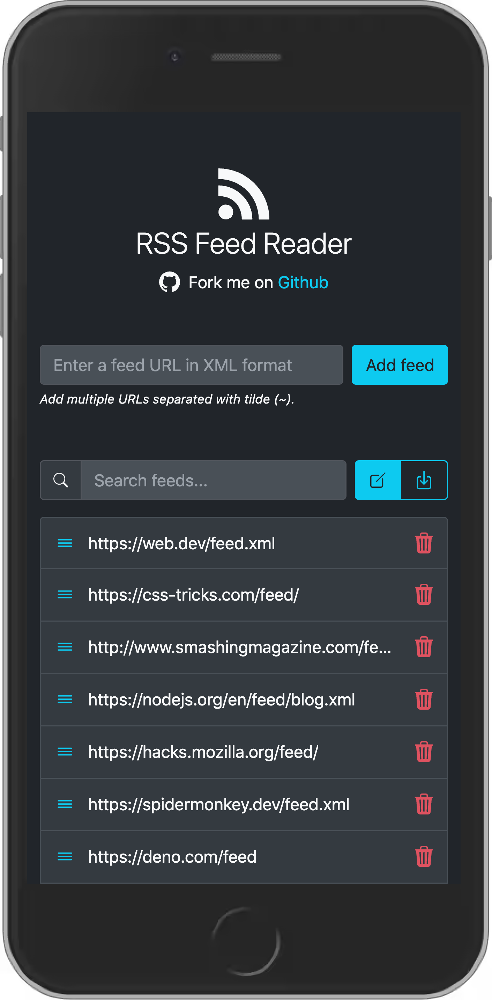

  

<h1 align="center">RSS Feed Reader</h1>

A simple RSS Feed Reader based on web technologies (HTML, CSS, JavaScript)

[Demo](https://georapbox.github.io/rss-feed-reader/)

## Features

- Add one or many RSS feeds in XML format.
- Enable/disable feeds per will.
- Export/share feeds URLs to use in other devices (all data is saved on device).

## Technologies used

- [RSS 2 JSON API](https://rss2json.com/) (used to convert feeds from XML to JSON format)
- Custom Elements aka Web components
- Progressive Web App (PWA)

## Screenshots

## RSS feeds collection

Here's a great [collection of RSS feeds](https://github.com/simevidas/web-dev-feeds) for web developers by [@simevidas](https://github.com/simevidas).

## License

[The MIT License (MIT)](https://georapbox.mit-license.org/@2022)
