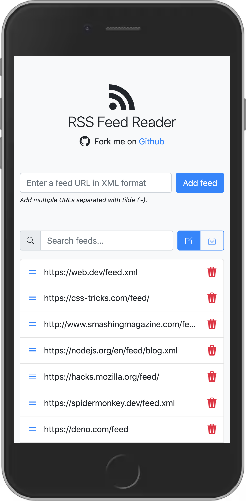

<p align="center">
  <a href="https://github.com/georapbox/rss-feed-reader">
    
  </a>
</p>

<h1 align="center">RSS Feed Reader</h1>

A simple RSS Feed Reader based on web technologies (HTML, CSS, JavaScript)

[Demo](https://georapbox.github.io/rss-feed-reader/)

## Features

- Add one or many RSS feeds in XML format.
- Enable/disable feeds per will.
- Export/share feeds URLs to use in other devices (all data is saved on device).

## Technologies used

- [RSS 2 JSON API](https://rss2json.com/) (used to convert feeds from XML to JSON format)
- Custom Elements aka Web components
- Progressive Web App (PWA)

## Screenshots



## Development

Below are the instructions for setting up the development environment.

### Prerequisites

- Node.js (v20.x.x)
- npm (v10.x.x)

### Installation

Clone the repository to your local machine:

```bash
git clone git@github.com:georapbox/rss-feed-reader.git
```

Navigate to the project's directory and install the dependencies:

```bash
npm install
```

### Running the application

To run the application in development mode, run the following command:

```bash
npm start -- --open
```

This will start the development server and open the application in your default web browser.

### Building the application for production

To build the application for production, run the following command:

```bash
npm run build
```

This will create a `dist` directory containing the production build of the application.

### Deployment

To deploy the application, run the following command:

```bash
npm run deploy
```

This will build the application first and then deploy it to GitHub Pages in the `gh-pages` branch.

## Helpful links

- [RSS feeds collection](https://github.com/simevidas/web-dev-feeds) for web developers by [@simevidas](https://github.com/simevidas).
- [Get RSS Feed URL](https://addons.mozilla.org/en-US/firefox/addon/get-rss-feed-url/) Firefox addon
- [Get RSS Feed URL](https://chrome.google.com/webstore/detail/get-rss-feed-url/kfghpdldaipanmkhfpdcjglncmilendn) Chrome extension

## License

[The MIT License (MIT)](https://georapbox.mit-license.org/@2022)
